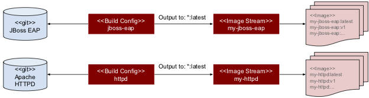
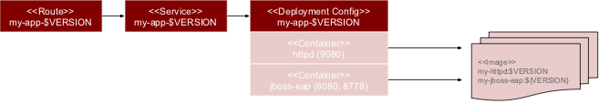

# Setup new project
```
oc new-project demo-project-01
```

# Setup Build Environment
The following overview shows the related OpenShift resources (Build Config + Image Stream) that are being created.



```
oc create -f build_config_httpd.yaml && oc create -f build_config_jboss-eap.yaml
```

# Setup deployments for latest version of the app
The following command creates the config objects (Deployment Config + Service Config + Route) to deploy the latest version of the app.


```
oc create -f deployment_config_app_latest.yaml
```

# Setup deployments for a specific version of the app 
The following command uses a template to create the config objects (Deployment Config + Service Config + Route) for specific version of the app. This is accomplished by injecting the parameter 'VERSION_TAG'. Moreover we use the label 'app-version' to group the version specific set of resources.



```
# [OPTIONAL] Create a new application release 'v1' from 'latest'
oc tag my-httpd:latest my-httpd:v1
oc tag my-jboss-eap:latest my-jboss-eap:v1

# Provision the 'v1' version of my app
oc process -f deployment_config_app_vX.yaml VERSION_TAG=v1 | oc create -f -
```

The following command deletes the resources of a specific app version (e.g. after testing has been completed).

```
oc delete all -l app-version=v1
```

# Cleanup project
```
oc delete project demo-project-01
```

# APPENDIX
[Source document for graphics](https://docs.google.com/drawings/d/1f5M8JRK4eBE4W29wuM9Fdh4mNHYnz5ZotOp1fmzWc3E/)