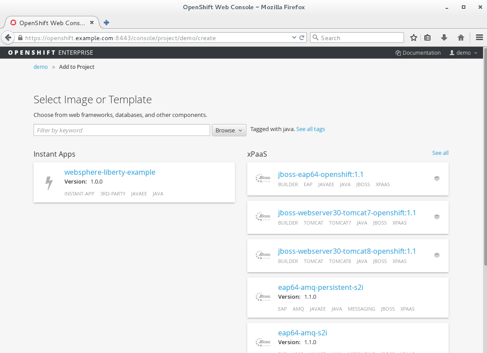
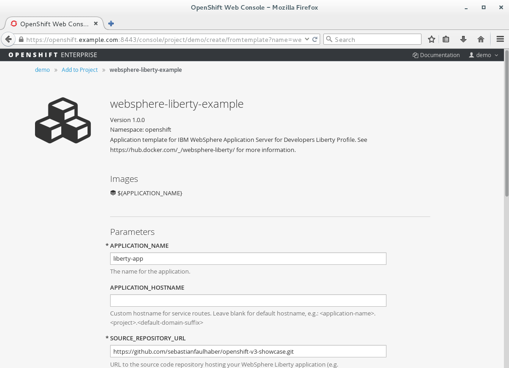
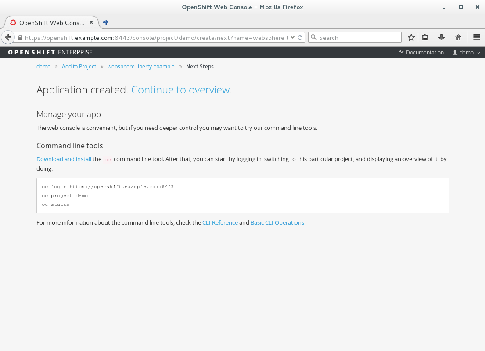
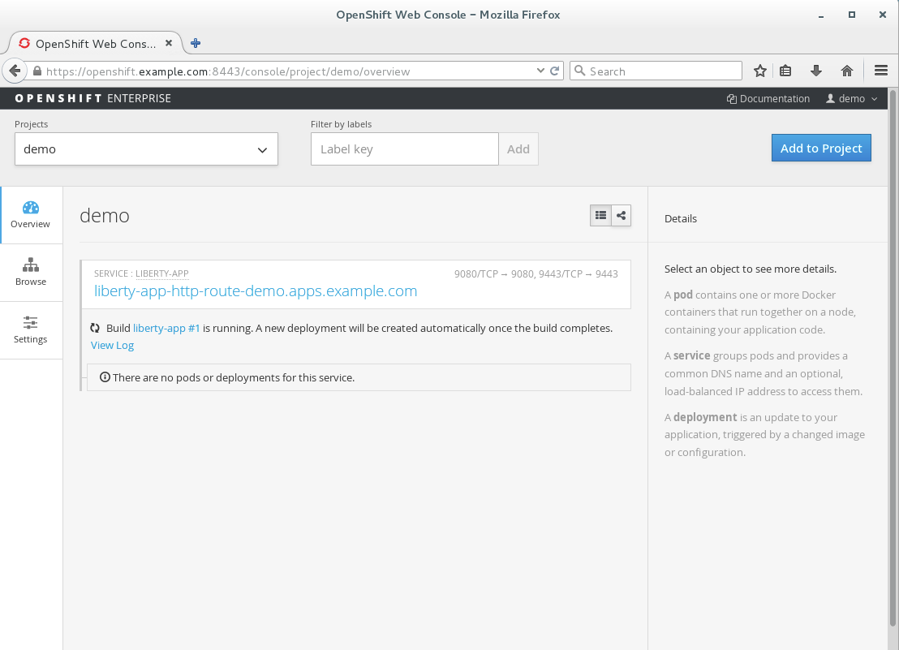
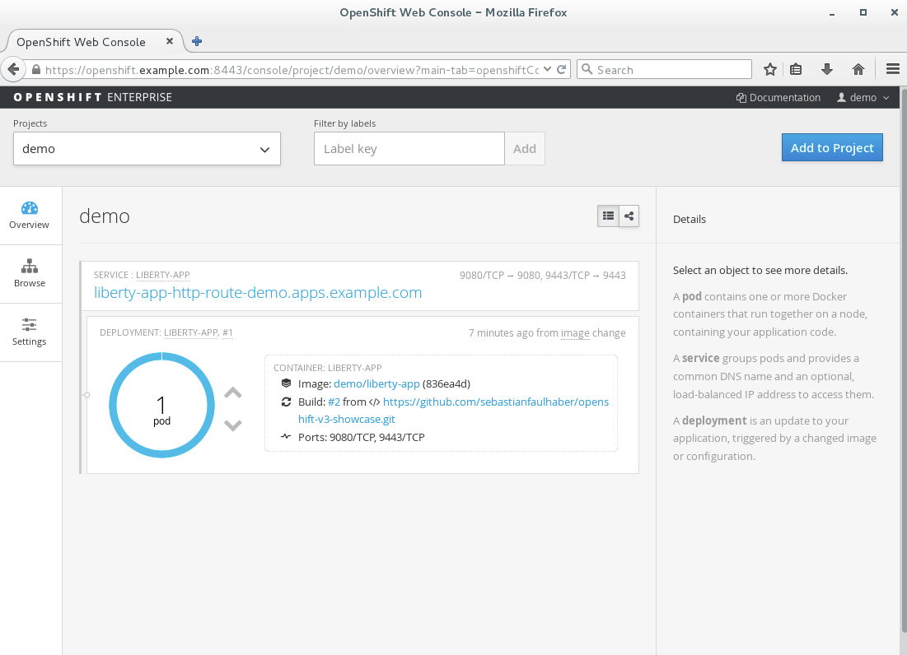
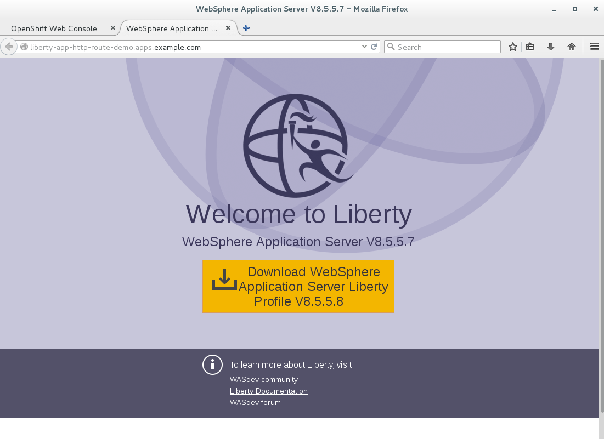
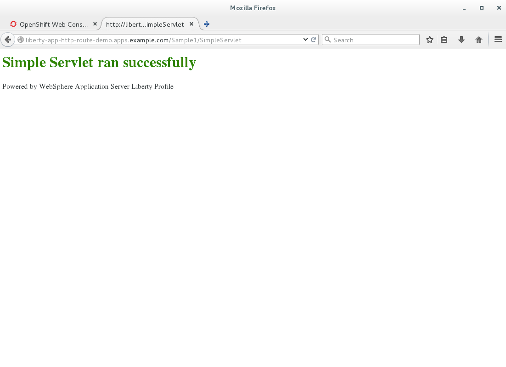
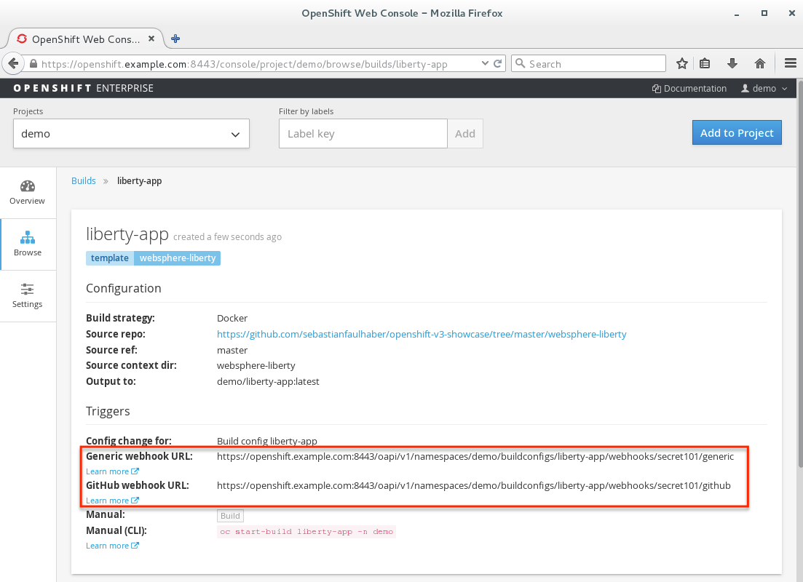
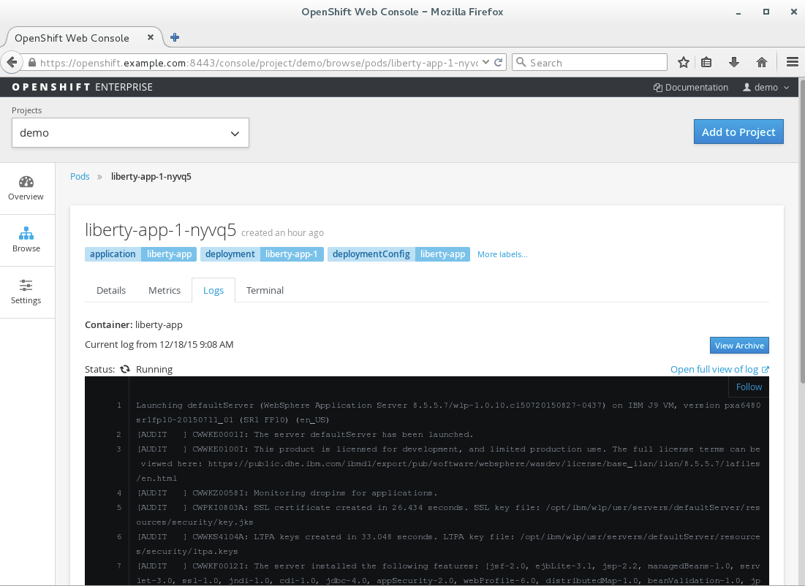
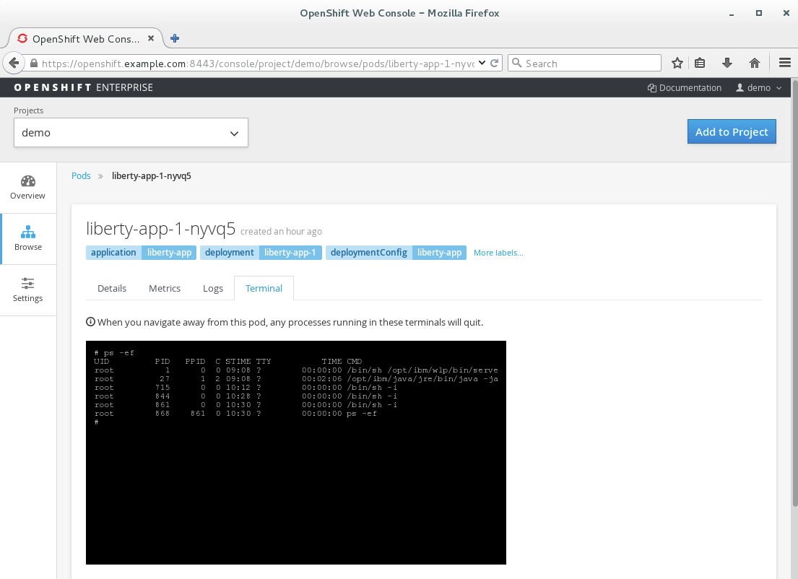

IBM WebSphere Application Server Liberty Core on OpenShift V3 Handbook
======================================================================

A. Synopsis
===========

What this is about
------------------
This project demonstrates how to use IBM WebSphere Liberty (a lightweight Java EE container comparable with Apache Tomcat) on Red Hat's leading  Platform-as-a-Service (PaaS) solution OpenShift Enterprise V3 (https://enterprise.openshift.com/). Since OpenShift is perfectly suited for running containerized workloads based on the Docker format, we could reuse the officially supported image built by IBM. Additionally we've added OpenShifts powerful templating mechanism in order to create a superior developer experience:

* Self-service based provisioning of new IBM WebSphere Application Server Liberty Core containers
* Existing, not yet containerized applications can simply be reused
* No prior experience with Docker needed
* Automated build & deploy life cycle

The source code can be found here: https://github.com/sebastianfaulhaber/openshift-v3-showcase/tree/master/websphere-liberty

Screenshots
------------------














B. Installation
===============

1. Setup OSE Environment
------------------------
There are multiple ways to spin up a new OpenShift environment:

#### All-In-One VM
This community provided Vagrant box probably provides the most convenient and fastest way to start your OpenShift developer experience. It features a complete OpenShift installation within one VM that allows you to test all aspects of a container application platform.

See for detailed instructions: http://www.openshift.org/vm/

#### On premise installation
The instructions for setting up an on premise installation of OpenShift Enterprise V3 can be found here: https://docs.openshift.com/enterprise/3.1/install_config/install/index.html.

#### OpenShift Dedicated
OpenShift Dedicated is a new offering from OpenShift Online. OpenShift Dedicated offers a hosted OpenShift 3 environment to run the containers powering your applications. This offering provides an isolated instance hosted on Amazon Web Services (AWS), providing increased security and management by the OpenShift operations team, so that you have peace of mind about the stability and availability of the platform.

See https://www.openshift.com/dedicated/

2. Enable OpenShift to run Docker images with USER in the Dockerfile
--------------------------------------------------------------------
The currently provided version of IBM's WebSphere Liberty Docker image requires the use of USER in the Dockerfile. Due to the security implications raised by USER statements OpenShift restricts the use by default. In order to make this project work, you will need to relax the security settings as described here: https://docs.openshift.com/enterprise/3.1/admin_guide/manage_scc.html#enable-images-to-run-with-user-in-the-dockerfile.

```
# Login to your OpenShift master via SSH
su -
oc edit scc restricted
# Change the runAsUser.Type strategy to RunAsAny
```

3. Import template into your OpenShift environment
--------------------------------------------------
```
wget https://raw.githubusercontent.com/sebastianfaulhaber/openshift-v3-showcase/master/websphere-liberty/websphere-liberty-template.json
oc create -f websphere-liberty-template.json -n openshift
```

C. User guide
========================

1. How can I access the provided demo application?
--------------------------------------------------
This project provides a simple Java EE web application that can be used to verify that the showcase is working. It can be accessed after provisioning via:  `<YOUR_FQDN>/Sample1/SimpleServlet` (e.g. http://liberty-app-http-route-demo.apps.example.com/Sample1/SimpleServlet).

2. How can I use this showcase in my own OpenShift installation?
----------------------------------------------------------------
1. Create a fork of the repository in your own GIT environment
2. Add your applications to the `app/` folder. They will be picked up and get deployed automatically.
3. Specify the URL to the forked project as `SOURCE_REPOSITORY_URL` when creating a new application.
4. Done.


3. How can I automate the build & deployment lifecycle
------------------------------------------------------
The project template comes with preconfigured OpenShift webhook triggers for Github and a generic system (see https://docs.openshift.com/enterprise/3.1/dev_guide/builds.html#webhook-triggers for more details).



In order to automate the build and deployment lifecycle you simply need to integrate the webhook URLs according to your SCM specific instructions:

* Github: https://developer.github.com/webhooks/
* Gitlab: http://doc.gitlab.com/ce/web_hooks/web_hooks.html


4. How can I view the logs of my application?
---------------------------------------------
The logs can be accessed via the OpenShift Enterprise console:
`Browse > Pods > YOUR_LIBERTY_POD > Logs`. Alternatively you could also use the CLI command `oc logs YOUR_LIBERTY_POD`  (https://docs.openshift.com/enterprise/3.1/cli_reference/basic_cli_operations.html#troubleshooting-and-debugging-cli-operations).



5. How can I connect to the container instance that is running my application?
----------------------------------------------------------------
You can open a terminal connection to the container via the OpenShift Enterprise console: `Browse > Pods > YOUR_LIBERTY_POD > Terminal`. Alternatively you could also use the CLI command `oc rsh YOUR_LIBERTY_POD` (https://docs.openshift.com/enterprise/3.1/cli_reference/basic_cli_operations.html#troubleshooting-and-debugging-cli-operations).



D. Reference Information
========================

WebSphere specific
------------------
* IBM WebSphere Application Server for Developers Liberty Profile documentation - https://hub.docker.com/_/websphere-liberty/
* Getting started with Liberty for Developers -  http://www.redbooks.ibm.com/abstracts/sg248076.html?Open
* Supported Software & Hardware -  http://www-01.ibm.com/support/docview.wss?uid=swg27038218

OpenShift specific
------------------
* Red Hat OpenShift Enterprise documentation -  https://docs.openshift.com/enterprise/3.1/welcome/index.html

E. Credits
==========
Special thanks to Chris Eberle <ceberle@redhat.com>
